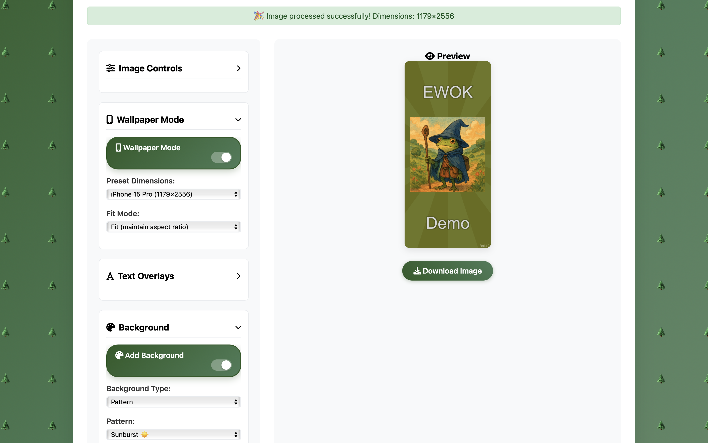

<div align="center">

# 🌲 Enhanced Watermark Overlay Kit (EWOK) 🌲
### *Your friendly forest companion for image editing adventures*

[](https://python.org)
[](https://flask.palletsprojects.com/)
[](LICENSE)

**EWOK** is a web application for image editing with watermark and overlay capabilities. Transform images with woodland wisdom. 🐻

</div>

---

## ✨ Features

🖼️ **Image Upload** - Support for JPG, PNG, GIF, BMP, WebP (max 16MB)  
🎚️ **Opacity Control** - Adjust image transparency with real-time slider  
📝 **Text Overlays** - Add multiple text overlays with customizable position, size, and color  
🏷️ **Watermark System** - Add text watermarks with various positioning options  
📱 **Wallpaper Mode** - Resize images to common device dimensions  
🎯 **Multiple Fit Modes** - Fit, crop, or stretch images to target dimensions  
👁️ **Real-time Preview** - See changes before downloading  
⬇️ **Download Output** - Save processed images as PNG files

## 📱 Wallpaper Presets

Create perfect wallpapers for any device with our comprehensive preset collection:

| Device Category | Available Presets |
|---|---|
| 📱 **iPhone** | 15 Pro, 15, 14 Pro, 14 |
| 📋 **iPad** | Pro 12.9", Air, Standard |
| 💻 **MacBook** | Air 13", Pro 14", Pro 16" |
| 🖥️ **Desktop** | iMac 24", Studio Display, Pro Display XDR |
| 📐 **Standard** | 1080p, 4K, 4:3, Square |


## 📸 Screenshot



---

## 🚀 Installation

1. Clone the repository:
```bash
git clone <repository-url>
cd enhanced-watermark-overlay-kit
```

2. Create a virtual environment:
```bash
python -m venv venv
source venv/bin/activate  # On Windows: venv\Scripts\activate
```

3. Install dependencies:
```bash
pip install -r requirements.txt
```

4. Run the application:
```bash
python app.py
```

5. Open your browser to `http://localhost:5000`

## 🎯 Usage

1. 📤 **Upload Image** - Drag and drop or click to browse for an image file
2. ⚙️ **Adjust Settings** - Use the controls panel to modify opacity, add text overlays, configure watermarks
3. 📱 **Wallpaper Mode** - Enable wallpaper mode and select preset dimensions if needed
4. ⚡ **Process** - Click "Process Image" to apply changes
5. 💾 **Download** - Use the download button to save your edited image

---

## 🔗 API Endpoints

| Method | Endpoint | Description |
|---|---|---|
| `POST` | `/api/upload` | 📤 Upload an image file |
| `POST` | `/api/process` | ⚡ Process image with specified parameters |
| `GET` | `/api/preview/<filename>` | 👁️ Preview processed image |
| `GET` | `/api/download/<filename>` | 💾 Download processed image |

---

## ⚙️ Configuration

The application uses these default settings:

```
📁 Upload folder: static/uploads/
📁 Temporary folder: temp/
📏 Max file size: 16MB
🖼️ Supported formats: PNG, JPG, JPEG, GIF, BMP, WebP
```

---

## 🛠️ Technology Stack

| Category | Technology |
|---|---|
| 🐍 **Backend** | Flask (Python) |
| 🖼️ **Image Processing** | Pillow (PIL) |
| 🎨 **Frontend** | HTML5, CSS3, JavaScript |
| 💅 **Styling** | Custom CSS with forest theme |
| 🎭 **Icons** | Font Awesome |

---

## 🧑‍💻 Development

To run in development mode:

```bash
export FLASK_ENV=development  # On Windows: set FLASK_ENV=development
python app.py
```

The application will run with debug mode enabled, providing detailed error messages and auto-reload on code changes.

---

## 🤝 Contributing

Contributions welcome. 🌲

1. Fork the repository
2. Create your feature branch (`git checkout -b feature/amazing-feature`)
3. Commit your changes (`git commit -m 'Add some amazing feature'`)
4. Push to the branch (`git push origin feature/amazing-feature`)
5. Open a Pull Request

---

## 📄 License

This project is licensed under the MIT License - see the [LICENSE](LICENSE) file for details.

---

<div align="center">

**Made with 🌲 by forest dwellers**

</div>