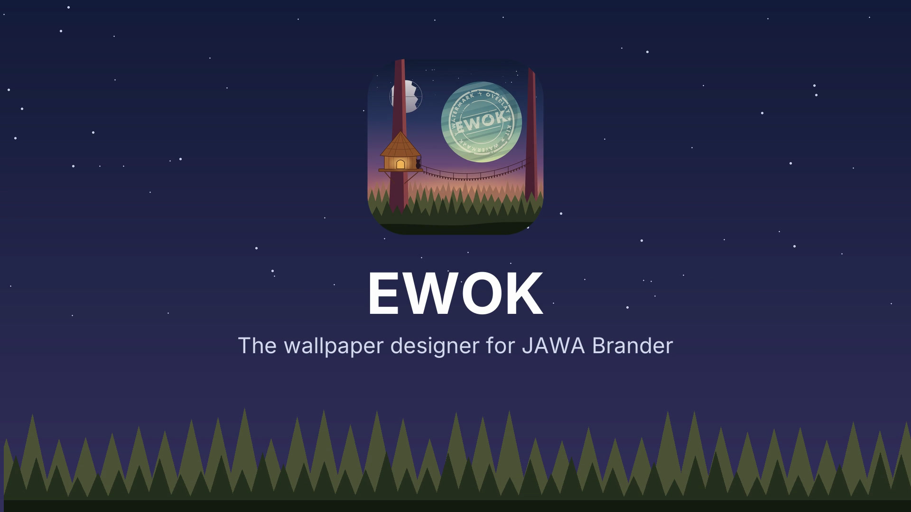

# Relic: EWOK launch video (/brag)

**Date:** 2026-10-02 · **Author:** Claude (session with operator) · **Status:** SHIPPED. This is the launch video for milestone 4: the new Endor icon, the template designer and `wallrender` 0.8.0.

- **Video:** [`2026-10-02-brag/brag.mp4`](2026-10-02-brag/brag.mp4), 21 s, 1920×1080, 30 fps, H.264 and AAC, 2.8 MB.
- **Poster:** [`2026-10-02-brag/brag.jpg`](2026-10-02-brag/brag.jpg). It is also frame 0 of the video, so players show it as the thumbnail.

## The angle

One template becomes the right wallpaper on every iPhone and iPad, and the preview in EWOK is exactly what lands on the device. The renderer is shared with JAWA, and a round-trip test proves the output is pixel-identical.

## Storyboard

| Time | Scene | On screen |
|---|---|---|
| 0.0–3.0 | Hook | A lock screen types in "Front Desk iPhone", then its serial, asset tag, building and QR code. "Every device. Its own wallpaper." |
| 3.0–6.2 | Reveal | The icon, **EWOK**, "The wallpaper designer for JAWA Brander". |
| 6.2–10.4 | Design | The designer's stage and properties panel; the chips `{{device_name}}`, `{{serial_number}}`, `{{asset_tag}}`. |
| 10.4–14.4 | Check | Safe-area guides, then the device grid. "Every screen checked before it ships." |
| 14.4–18.0 | Ship | An iPhone, a portrait iPad and a landscape iPad from one template. "One template. Every device." |
| 18.0–21.0 | Outro | **EWOK × JAWA Brander**, "Design it. Tap the web clip. Done." and the repository address. |

All device data is invented sample data (most of it from `config.py`). No real tenant, host or person appears.

## How it was made

- **Frames:** a Pillow script draws every frame as a function of time. The devices are real `wallrender` renders of the sample templates, and the design scenes use screenshots of the running designer. The frames are piped to ffmpeg.
- **Sound:** synthesized with numpy, in A minor at 96 bpm: a pad on Am, F, C, G, a plucked arpeggio from the reveal, key ticks under the typing, whooshes at each cut and a resolving chord at the outro. It peaks at −1 dBFS.
- **Type and color:** Inter, the night sky and forest from the icon, and Brander navy (`#0B2545`) on the device screens.

## Share copy

Short:

> EWOK designs Brander wallpapers for Jamf fleets. Drop in device variables, check every screen, and JAWA renders it on each iPhone and iPad, pixel for pixel.
> github.com/ball42/enhanced-watermark-overlay-kit

Longer:

> Every device. Its own wallpaper.
>
> EWOK is the template designer for JAWA Brander. Lay out text, QR codes and images with `{{device_name}}`, `{{serial_number}}`, `{{asset_tag}}` and role variants, then check the lock screen clock, controls and crops for each device before anything ships.
>
> The same renderer is vendored into JAWA, so the preview is what lands on the device: one template, every supervised iPhone and iPad, one tap on a web clip.
>
> Open source: github.com/ball42/enhanced-watermark-overlay-kit
